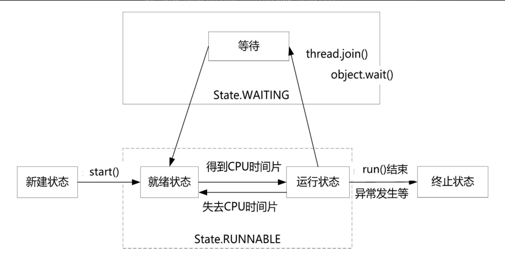

# 线程的基本操作

## Thread.sleep()

### Introduction

The Java ```Thread.sleep()``` method can be used to pause the execution of the current thread for a specified time in milliseconds. The argument value for milliseconds cannot be negative. Otherwise, it throws ```IllegalArgumentException```.

```sleep(long millis, int nanos)``` is another method that can be used to pause the execution of the current thread for a specified number of milliseconds and nanoseconds. The allowed nanosecond values are between ```0``` and ```999999```.

### How Thread.sleep Works

```Thread.sleep()``` interacts with the thread scheduler to put the current thread in a wait state for a specified period of time. Once the wait time is over, the thread state is changed to a runnable state and waits for the CPU for further execution. The actual time that the current thread sleeps depends on the thread scheduler that is part of the operating system.

### Thread.sleep important points

1. It always pauses the current thread execution.
2. The actual time the thread sleeps before waking up and starting execution depends on system timers and schedulers. For a quiet system, the actual time for sleep is near to the specified sleep time, but for a busy system, it will be a little bit longer.
3. ```Thread.sleep()``` doesn’t lose any monitors or lock the current thread it has acquired.
4. Any other thread can interrupt the current thread in sleep, and in such cases ```InterruptedException``` is thrown.

### 状态改变

RUNNABLE -> TIMED_WAITING

**```sleep()```方法会有```InterruptException```受检异常抛出，如果调用了```sleep()```方法，就必须进行异常审查，捕获```InterruptedException```异常，或者再次通过方法声明存在```InterruptedException```异常。**

## Thread.interrupt

**只起一个标记作用,不实际直接停止线程的执行.**线程的停止可通过该标记判断,在实际代码中做出响应. 在退出前,能做好清除工作.

区别于```stop()```的直接打断.线程无法完成清理工作.此方法应尽量不使用.

### Introduction

The ```interrupt()``` method of thread class is used to interrupt the thread. If any thread is in **sleeping** or **waiting** state (i.e. ```sleep()``` or ```wait()``` is invoked) then using the ```interrupt()``` method, we can interrupt the thread execution by throwing ```InterruptedException```.

If the thread is not in the sleeping or waiting state then calling the ```interrupt()``` method performs a normal behavior and doesn't interrupt the thread but sets the interrupt flag to true.



## Thread.join

The join method allows one thread to wait for the completion of another. If t is a Thread object whose thread is currently executing,

```t.join();```

causes the current thread to pause execution until t's thread **terminates**. Overloads of join allow the programmer to specify a waiting period. However, as with sleep, join is dependent on the OS for timing, so you should not assume that join will wait exactly as long as you specify.

Like sleep, join responds to an interrupt by exiting with an ```InterruptedException```.

## Thread.yield

线程的yield（让步）操作的作用是让目前正在执行的线程放弃当前的执行，让出CPU的执行权限，使得CPU去执行其他的线程。处于让步状态的JVM层面的线程状态仍然是RUNNABLE状态，但是该线程所对应的操作系统层面的线程从状态上来说会从执行状态变成就绪状态。线程在yield时，线程放弃和重占CPU的时间是不确定的，可能是刚刚放弃CPU，马上又获得CPU执行权限，重新开始执行。

yield()方法是Thread类提供的一个静态方法，它可以让当前正在执行的线程暂停，但它不会阻塞该线程，只是让线程转入就绪状态。yield只是让当前线程暂停一下，让系统的线程调度器重新调度一次

## daemon

Java中的线程分为两类：守护线程与用户线程。守护线程也称为后台线程，专门指在程序进程运行过程中，在后台提供某种通用服务的线程。

只要JVM实例中尚存在任何一个用户线程没有结束，守护线程就能执行自己的工作；只有当最后一个用户线程结束，守护线程随着JVM一同结束工作。

### 注意点

1. **守护线程必须在启动前将其守护状态设置为true，启动之后不能再将用户线程设置为守护线程，否则JVM会抛出一个InterruptedException异常。** 具体来说，如果线程为守护线程，就必须在线程实例的start()方法调用之前调用线程实例的setDaemon(true)，设置其daemon实例属性值为true。
2. **守护线程存在被JVM强行终止的风险，所以在守护线程中尽量不去访问系统资源，如文件句柄、数据库连接等。守护线程被强行终止时，可能会引发系统资源操作不负责任的中断，从而导致资源不可逆的损坏。**
3. **守护线程创建的线程也是守护线程。** 在守护线程中创建的线程，新的线程都是守护线程。在创建之后，如果通过调用setDaemon(false)将新的线程显式地设置为用户线程，新的线程可以调整成用户线程。

## 总结

### 就绪状态

进入就绪状态包含以下几种情况:

* 调用线程的start()方法，此线程就会进入就绪状态。
* 当前线程的执行时间片用完。
* 线程睡眠（Sleep）操作结束。
* 对其他线程合入（Join）操作结束。
* 等待用户输入结束。
* 线程争抢到对象锁（Object Monitor）。
* 当前线程调用了yield()方法出让CPU执行权限。

### BLOCKED状态

处于BLOCKED（阻塞）状态的线程并**不会占用CPU资源**，以下情况会让线程进入阻塞状态：

1. **线程等待获取锁.** 等待获取一个锁，而该锁被其他线程持有，则该线程进入阻塞状态。当其他线程释放了该锁，并且线程调度器允许该线程持有该锁时，该线程退出阻塞状态。
2. **IO阻塞.** 线程发起了一个阻塞式IO操作后，如果不具备IO操作的条件，线程就会进入阻塞状态。IO包括磁盘IO、网络IO等。IO阻塞的一个简单例子：线程等待用户输入内容后继续执行。

### WAITING状态

处于WAITING（无限期等待）状态的线程**不会被分配CPU时间片**，需要被其他线程显式地唤醒，才会进入就绪状态。线程调用以下3种方法会让自己进入无限等待状态：

1. ```Object.wait()```方法，对应的唤醒方式为：```Object.notify()```/```Object.notifyAll()```。
2. ```Thread.join()```方法，对应的唤醒方式为：被合入的线程执行完毕。
3. ```LockSupport.park()```方法，对应的唤醒方式为：```LockSupport.unpark(Thread)```。

### TIMED_WAITING状态

处于TIMED_WAITING（限时等待）状态的线程**不会被分配CPU时间片**，如果指定时间之内没有被唤醒，限时等待的线程会被系统自动唤醒，进入就绪状态。以下3种方法会让线程进入限时等待状态：

1. ```Thread.sleep(time)```方法，对应的唤醒方式为：sleep睡眠时间结束。
2. ```Object.wait(time)```方法，对应的唤醒方式为：调用```Object.notify()```/```Object.notifyAll()```主动唤醒，或者限时结束。
3. ```LockSupport.parkNanos(time)```/```parkUntil(time)```方法，对应的唤醒方式为：线程调用配套的```LockSupport.unpark(Thread)```方法结束，或者线程停止（park）时限结束。

**进入BLOCKED状态、WAITING状态、TIMED_WAITING状态的线程都会让出CPU的使用权；另外，等待或者阻塞状态的线程被唤醒后，进入Ready状态，需要重新获取时间片才能接着运行。**